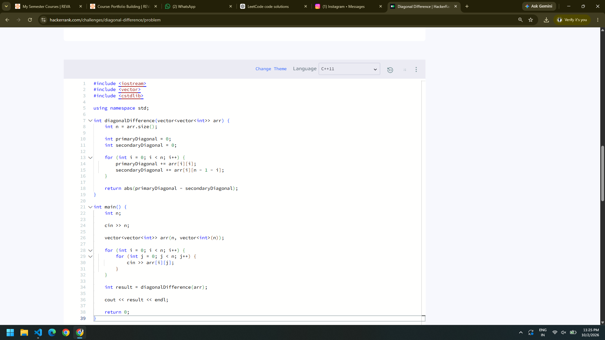
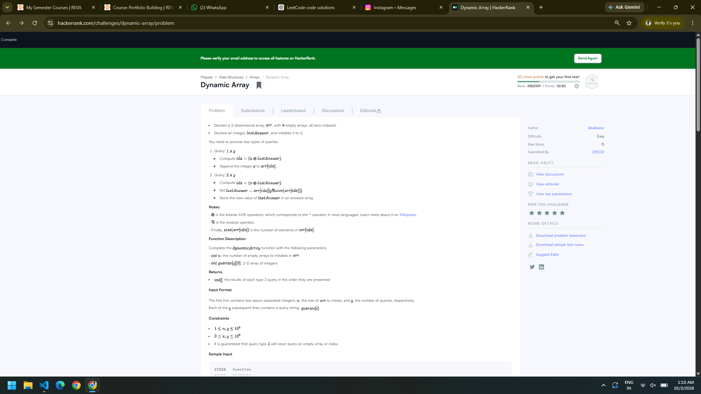

# HackerRank 3rd Semester Portfolio

## Student Details

- **Name:** Diwakar Naik
- **SRN:** R25EJ032
- **Course:** B.Tech Computer Science and Engineering
- **Semester:** 3rd Semester

## HackerRank Profile

[My HackerRank Profile](https://www.hackerrank.com/profile/diwakarnaikai)

## Problems Solved

| No. | Problem | Topic | Time Complexity | Space Complexity |
|---|---|---|---|---|
| 1 | Diagonal Difference | 2D Arrays / Matrices | O(N) | O(1) |
| 2 | Dynamic Array | Data Structures / Vectors | O(N + Q) | O(N) |
| 3 | Time Conversion | Strings & Logic | O(1) | O(1) |
| 4 | Compare the Triplets | Basic Implementation | O(1) | O(1) |
| 5 | Sparse Arrays | Hash Maps / Strings | O(N + Q) | O(N) |

## Solutions

### 1. Diagonal Difference

[View Solution](./diagonal-difference/01-diagonal-difference.cpp)

### 2. Dynamic Array

[View Solution](./dynamic-array/02-dynamic-array.cpp)

### 3. Time Conversion

[View Solution](./time-conversion/03-time-conversion.cpp)

### 4. Compare the Triplets

[View Solution](./compare-the-triplets/04-compare-the-triplets.cpp)

### 5. Sparse Arrays

[View Solution](./sparse-arrays/05-sparse-arrays.cpp)

## HackerRank Submission Screenshots

### 1. Diagonal Difference

### 2. Dynamic Array

### 3. Time Conversion

### 4. Compare the Triplets

### 5. Sparse Arrays

## HackerRank Badge

HackerRank badge screenshot will be added here.

## Reflection

This activity helped me improve my algorithmic problem-solving skills by solving problems involving arrays, strings, matrices, vectors, and hash maps. I learned how choosing an appropriate data structure can make a solution more efficient and easier to implement. In Diagonal Difference, I practiced traversing a matrix efficiently by accessing both diagonals in a single loop. Dynamic Array helped me understand sequence-based data structures and the use of XOR for selecting sequences. Time Conversion improved my understanding of string manipulation and 12-hour to 24-hour time conversion. Compare the Triplets strengthened my basic comparison and counting logic. Sparse Arrays introduced the practical use of hash maps for efficient frequency counting. I also learned the importance of analyzing time and space complexity before implementing a solution. Organizing the solutions in separate folders and maintaining them in GitHub helped me understand how to build a structured programming portfolio and track my problem-solving progress.